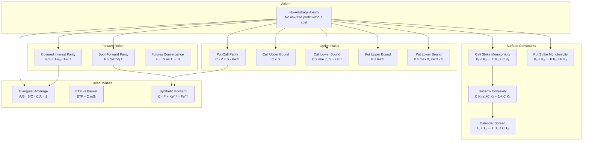
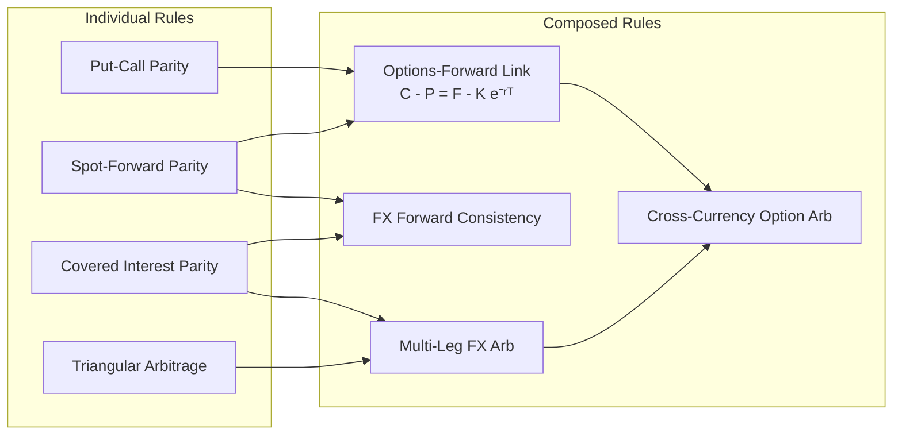
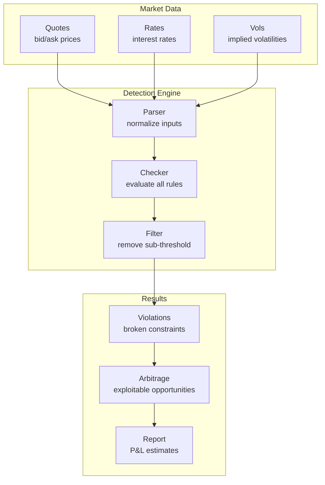
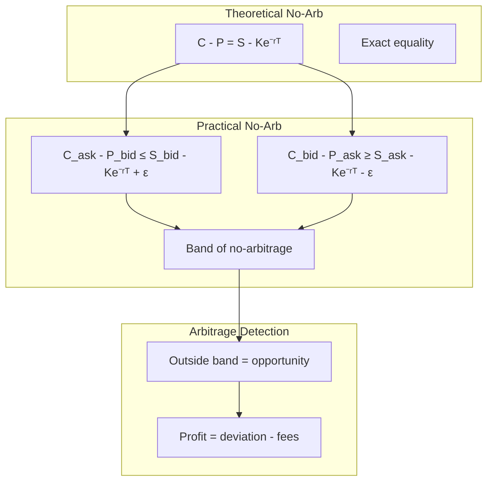

# No-Arbitrage Rules: Visual Reference

This document provides visual representations of all no-arbitrage rules in the framework and their relationships.

---

## Rule Dependency Graph

Rules derive from the fundamental no-arbitrage axiom and compose to form more complex detection criteria.



---

## Rule Composition Map

Shows how combining rules yields new arbitrage detection capabilities.



---

## Detection Flow

How market data flows through the rule engine.



---

## Bid/Ask Impact

How bid/ask spreads tighten arbitrage bounds.



---

## Option Bounds Visualization

```
Price
  │
  │                          ╱
  │                        ╱
  │                      ╱    Call Price
S ┼─────────────────────●─────────────────  Upper Bound: C ≤ S
  │                   ╱ │
  │                 ╱   │
  │               ╱     │
  │             ╱       │
  │           ╱         │
  │         ●───────────┼─────────────────  C = max(0, S - Ke⁻ʳᵀ)
  │       ╱             │                   Lower Bound
  │     ╱               │
  │   ╱                 │
  │ ╱                   │
  ●─────────────────────┼─────────────────
  │                     │
  └─────────────────────┴─────────────────▶ Strike K
                      K = S·e^(rT)
                     (ATM forward)
```

---

## Strike Monotonicity & Convexity

```
Call
Price
  │
  │●
  │ ╲
  │  ╲
  │   ╲
  │    ●                    ← Monotonically decreasing
  │     ╲
  │      ╲
  │       ●
  │        ╲
  │         ╲
  │          ●
  │           ╲
  │            ●
  └──────────────────────▶ Strike K
     K₁  K₂  K₃  K₄  K₅

Convexity: The curve must be convex (bowl-shaped upward)
           C(K₂) ≤ ½C(K₁) + ½C(K₃) when K₂ = ½(K₁ + K₃)

Violation: If C(K₂) > ½C(K₁) + ½C(K₃)
           → Negative butterfly → Arbitrage!
```

---

## Calendar Spread Constraint

```
Option
Price
  │
  │                           ● T = 1Y
  │                         ╱
  │                       ╱
  │                     ╱     ● T = 6M
  │                   ╱     ╱
  │                 ╱     ╱
  │               ╱     ╱     ● T = 3M
  │             ╱     ╱     ╱
  │           ╱     ╱     ╱
  │         ●     ●     ●
  │        ╱    ╱     ╱
  │      ╱    ╱     ╱
  │    ╱    ╱     ╱
  │  ╱    ╱     ╱
  │╱    ╱     ╱
  ●────●─────●────────────────▶ Strike K

Rule: Longer-dated options ≥ shorter-dated (same strike)
      T₁ < T₂ → C(K, T₁) ≤ C(K, T₂)

Violation: Near-dated costs more than far-dated
           → Calendar spread arbitrage!
```

---

## Triangular Arbitrage (FX)

```
                    EUR
                   ╱   ╲
                 ╱       ╲
          EUR/USD         EUR/JPY
              ╱             ╲
            ╱                 ╲
          USD ─────────────── JPY
                  USD/JPY

Constraint: EUR/USD × USD/JPY × JPY/EUR = 1

Example:
  EUR/USD = 1.10
  USD/JPY = 150
  EUR/JPY = 163  (should be 1.10 × 150 = 165)

  Product = 1.10 × 150 × (1/163) = 1.012 ≠ 1

  Arbitrage:
    1. Sell EUR, buy USD (get 1.10 USD)
    2. Sell USD, buy JPY (get 165 JPY)
    3. Sell JPY, buy EUR (get 165/163 = 1.012 EUR)
    4. Profit: 1.2% risk-free
```

---

## Summary Table

| Rule | Type | Inputs | Constraint | Violation = |
|------|------|--------|------------|-------------|
| Put-Call Parity | Equality | C, P, S, K, r, T | C - P = S - Ke⁻ʳᵀ | Synthetic mispricing |
| Call Upper | Bound | C, S | C ≤ S | Overpriced call |
| Call Lower | Bound | C, S, K, r, T | C ≥ max(0, S - Ke⁻ʳᵀ) | Underpriced call |
| Put Upper | Bound | P, K, r, T | P ≤ Ke⁻ʳᵀ | Overpriced put |
| Put Lower | Bound | P, S, K, r, T | P ≥ max(0, Ke⁻ʳᵀ - S) | Underpriced put |
| Call Monotonicity | Inequality | C(K₁), C(K₂) | K₁<K₂ → C(K₁)≥C(K₂) | Strike inversion |
| Put Monotonicity | Inequality | P(K₁), P(K₂) | K₁<K₂ → P(K₁)≤P(K₂) | Strike inversion |
| Butterfly | Convexity | C(K₁), C(K₂), C(K₃) | Convex in K | Negative butterfly |
| Calendar | Inequality | C(T₁), C(T₂) | T₁<T₂ → C(T₁)≤C(T₂) | Negative calendar |
| Spot-Forward | Equality | F, S, r, q, T | F = Se^(r-q)T | Basis mispricing |
| Covered Interest | Equality | F, S, rₐ, r_f | F/S = (1+rₐ)/(1+r_f) | FX forward mispricing |
| Triangular | Product | A/B, B/C, C/A | Product = 1 | Cross-rate inconsistency |

---

## Implementation Priority

```mermaid
gantt
    title Implementation Roadmap
    dateFormat X
    axisFormat %s

    section Core
    Types & Axioms           :a1, 0, 1
    Arbitrage Definition     :a2, 0, 1

    section Options
    Put-Call Parity          :b1, 1, 2
    Option Bounds            :b2, 1, 2
    Strike Monotonicity      :b3, 2, 3
    Butterfly Convexity      :b4, 3, 4
    Calendar Spreads         :b5, 4, 5

    section Forwards
    Spot-Forward Parity      :c1, 2, 3
    Covered Interest Parity  :c2, 3, 4

    section Cross-Market
    Triangular Arbitrage     :d1, 4, 5
    Synthetic Forward        :d2, 5, 6
    ETF vs Basket            :d3, 5, 6

    section Detection
    Constraint Checker       :e1, 6, 7
    Violation Scanner        :e2, 7, 8
```


